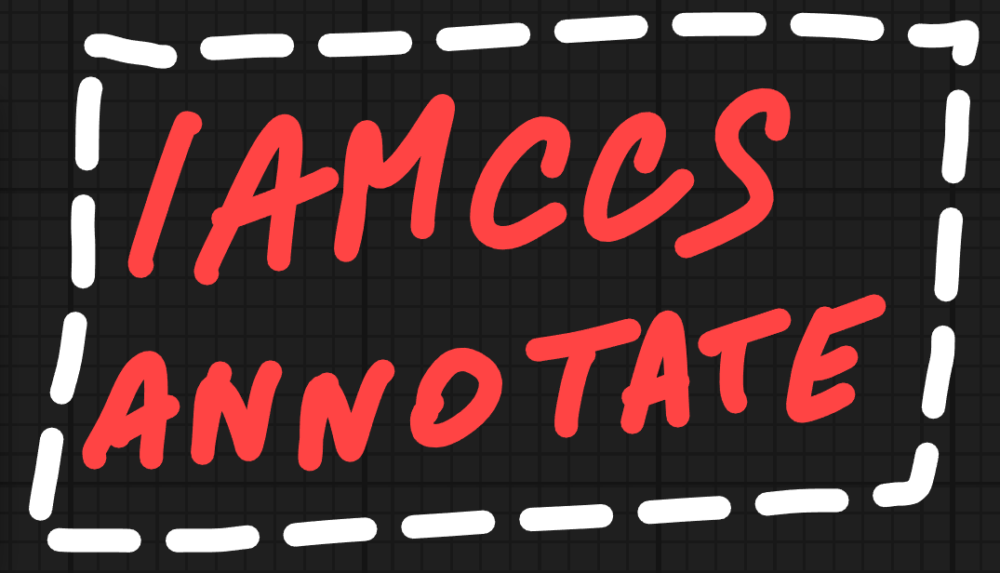
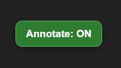
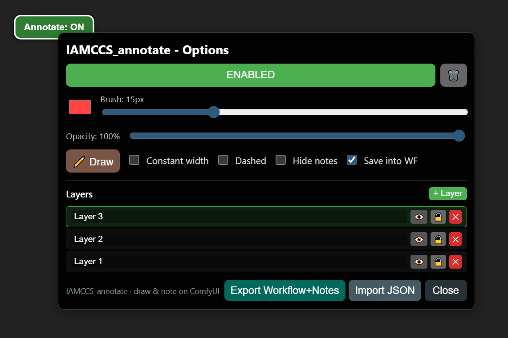

# IAMCCS Annotate - ComfyUI Drawing Extension


Version: 1.0.0 — Coming soon: 2.0.0 (many new features!)

A powerful drawing and annotation tool for ComfyUI that lets you add notes, sketches, and annotations directly on your workflow canvas with full layer support.



## Features

✨ **Drawing Tools**
- Free-hand drawing with customizable brush size (1-48px)
- Eraser mode to remove strokes
- Color picker for custom drawing colors
- Opacity control (10-100%)
- Dashed line option for different line styles
- Constant width option (maintains width at any zoom level)
 - HiDPI ×2 rendering toggle for crisper strokes
- pen-only mode (4 tablet use)

🎨 **Layer System**
- Create unlimited layers for organized annotations
- Toggle layer visibility (eye icon)
- Lock/unlock layers to prevent accidental editing
- Rename layers inline (double-click the name)
- Delete layers (minimum 1 layer always kept)
- Auto-selects new layer as active

📌 **State Management**
- Save annotations with workflow (automatic)
- Load annotations when reopening workflows
- Quick toggle to hide/show all annotations
- Persistent layer structure across sessions

🖱️ **User Interface**
- Floating button with context menu (right-click)



- Draggable button (click to toggle, drag to move)
- Compact control panel in context menu
- Inline layer naming (no popups)
- Real-time visual feedback



🎯 **Keyboard Shortcuts**
| Shortcut | Action |
|----------|--------|
| **Alt+A** | Toggle annotation mode ON/OFF |
| **Alt+D** | Toggle eraser / draw mode |
| **Alt+S** | Toggle hide/show annotations |
| **Esc** | Cancel current stroke |

## Installation

1. Download or clone this extension into your ComfyUI custom_nodes folder:
```bash
cd ComfyUI/custom_nodes
git clone https://github.com/IAMCCS/IAMCCS_annotate.git
```

2. Restart ComfyUI

3. Look for the **"Annotate: OFF"** button in the bottom-left corner

### If my work helped you, and you’d like to say thanks — grab me a coffee ☕

<a href="https://www.buymeacoffee.com/iamccs" target="_blank">
  
</a>

## Usage

### Basic Drawing
1. Click the floating button to enable annotation mode (turns green)
2. Click and drag on the canvas to draw
3. Adjust brush size and color from the context menu (right-click button)
4. Click the button again to disable (turns red)

### Using the Eraser
1. Press **Alt+D** or click the eraser button in the menu (🩹 Eraser)
2. Draw on the canvas to erase strokes
3. Press **Alt+D** again to return to draw mode (✏️ Draw)

### Managing Layers
1. Click **"+ Layer"** button to create a new layer
2. **Click** on layer name to select it
3. **Double-click** layer name to rename it (press Enter to confirm, Esc to cancel)
4. Use **eye icon** to hide/show layer
5. Use **lock icon** to prevent editing
6. Use **X button** to delete layer

### Hiding Annotations
- Press **Alt+S** to quickly toggle visibility of all annotations
- Useful for viewing your workflow without the annotations

### Workflow Integration
- Annotations are **automatically saved** when you save your workflow
- When you open a workflow that has annotations, they load automatically
- Each workflow has its own separate annotations

## Context Menu Options

Right-click the floating button to access:
- **Enable/Disable** - Quick toggle (also left-click button)
- **Color Picker** - Choose drawing color
- **Brush Size** - Adjust pen width (1-48px)
- **Opacity** - Control transparency (10-100%)
- **Drawing Modes**:
  - ✏️ Draw / 🩹 Eraser toggle
  - Constant width option
  - Dashed lines option
  - Hide notes option
- **Layer Management** - Create, rename, manage layers
- **Export/Import** - Save/load annotations separately
- **Save into Workflow** - Toggle auto-save feature

## Tips & Tricks

💡 **Pro Tips**
- Use **Alt+S** while working to hide annotations and see clean canvas
- Layer-based organization helps keep complex annotations organized
- Constant width mode is great for diagrams and technical annotations
- Export annotations as JSON for backup or sharing

🎨 **Drawing Best Practices**
- Use different layers for different annotations (ideas, notes, corrections)
- Keep brush size reasonable for readability at normal zoom
- Lock completed layers to avoid accidental edits
- Use dashed lines to distinguish annotations from actual drawing

🔄 **Workflow Tips**
- Annotations persist across ComfyUI sessions
- Copy workflow JSON to backup annotations
- Use hide toggle (Alt+S) for presentations
- Export layers separately for different annotations


## Troubleshooting

**Button doesn't appear?**
- Restart ComfyUI
- Check browser console for errors (F12)
- Verify extension is in `custom_nodes/IAMCCS_annotate`

**Annotations not saving?**
- Check "Save into workflow" toggle in menu
- Ensure workflow is saved to disk
- Check browser console for errors

**Eraser not working?**
- Make sure you're in eraser mode (button shows 🩹)
- Try pressing Alt+D to toggle mode
- Check that layer is not locked

**Layer issues?**
- At least one layer is always required
- Can't delete if it's the only layer
- Locked layers prevent drawing but still show

**Keyboard Shortcuts Quick Reference:**
- 🖱️ **Left-click button** = Toggle ON/OFF
- 🖱️ **Right-click button** = Open menu
- 🖱️ **Drag button** = Move it around
- ⌨️ **Alt+A** = Toggle annotation
- ⌨️ **Alt+D** = Toggle eraser
- ⌨️ **Alt+S** = Toggle hide
- ⌨️ **Esc** = Cancel stroke

## Credits

**IAMCCS_annotate** - Drawing & annotation tool for ComfyUI
Minimal, compact, and powerful annotation system


# Full license: CC BY-SA 4.0 by IAMCCS (2025)

Found a bug or have a feature request?
- Check the GitHub issues
- Report problems with detailed description
- Include ComfyUI version and browser info

---
