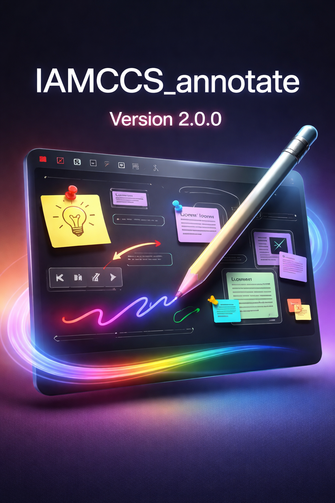

# IAMCCS Annotate - ComfyUI Drawing Extension


Version: 2.0.0

#A powerful drawing and annotation tool for ComfyUI that lets you add notes, sketches, and annotations directly on your workflow canvas with full layer support.



## Features

✨ **Drawing Tools**
- Free-hand drawing with customizable brush size (1-48px)
- Eraser mode to remove strokes
- Color picker for custom drawing colors
- Opacity control (10-100%)
- Dashed line option for different line styles
- Constant width option (maintains width at any zoom level)
 - HiDPI ×2 rendering toggle for crisper strokes
- pen-only mode (4 tablet use)
- Pin/unpin mode for screenshot post-its

🎨 **Layer System**
- Create unlimited layers for organized annotations
- Toggle layer visibility (eye icon)
- Lock/unlock layers to prevent accidental editing
- Rename layers inline (double-click the name)
- Delete layers (minimum 1 layer always kept)
- Auto-selects new layer as active

🧩 **Subgraph-aware Annotations (NEW in 2.0.0)**
- Separate drawings per graph/subgraph: entering a subgraph shows its own annotations only
- Returning to the main workflow restores the main workflow annotations

🧰 **Selection Tools (NEW in 2.0.0)**
- Select tool with modes: Rectangle, Free-form, Lasso (drag required; no click-to-rect)
- Copy / Cut / Paste for selected annotations
- Selected items are highlighted after selection; the big selection frame only appears while dragging
- Delete selected items with **Delete** or **Backspace** (any tool)

🧭 **Transform / Rotate (NEW in 2.0.0)**
- Transform: scale selected items by dragging a corner handle
- Rotate: rotate selected items by dragging a corner handle
- Corner hit-area is enlarged and handles are visible for easier grabbing

📝 **Text Layers (NEW in 2.0.0)**
- Create resizable text boxes directly on the workflow (drag to size, then type)
- Choose font family and font size from the context menu controls
- Double-click a text box to edit it later
- Text boxes behave like a single object for Select / Transform / Rotate (whole box, not individual letters)

📸 **Screenshot Post-it (NEW in 2.0.0)**
- Screenshot tool: drag a rectangle to capture any visible area (nodes/images/annotations)
- The capture becomes a movable “post-it” you can place anywhere
- Post-it appearance controls: configurable frame color, padding, border width, and optional shadow
- Move post-its by dragging any edge (works even when Annotate is OFF)
- Pin a post-it to lock it in place

📌 **State Management**
- Local autosave (survives refresh even if you don’t save the workflow)
- Optional “Save into Workflow” (embeds notes into the workflow JSON)
- Load annotations when reopening workflows
- Quick toggle to hide/show all annotations
- Persistent layer structure across sessions

🖱️ **User Interface**
- Floating button with context menu (right-click)
- Tools and Post-it settings are also available in the sidebar panel when present; otherwise a draggable dock panel appears near the canvas


- Draggable button (click to toggle, drag to move)
- Compact control panel in context menu
- Inline layer naming (no popups)
- Real-time visual feedback


🎯 **Keyboard Shortcuts**
| Shortcut | Action |
|----------|--------|
| **Alt+A** | Toggle annotation mode ON/OFF |
| **Alt+D** | Toggle eraser / draw mode |
| **Alt+S** | Toggle hide/show annotations |
| **Alt+1** | Tool: Draw |
| **Alt+2** | Tool: Select |
| **Alt+3** | Tool: Transform |
| **Alt+4** | Tool: Rotate |
| **Alt+5** | Tool: Screenshot |
| **Alt+P** | Toggle Pin/unpin mode |
| **Ctrl+I** | Import workflow + notes (JSON) |
| **Ctrl+C** | Copy selection (Select tool) |
| **Ctrl+X** | Cut selection (Select tool) |
| **Ctrl+V** | Paste selection (Select tool) |
| **Delete / Backspace** | Delete current selection (any tool) |
| **Esc** | Cancel current stroke |

Notes:
- Tool shortcuts (**Alt+1..5**) and **Alt+P** are active when Annotate is ON.

## Installation

1. Download or clone this extension into your ComfyUI custom_nodes folder:
```bash
cd ComfyUI/custom_nodes
git clone https://github.com/IAMCCS/IAMCCS_annotate.git
```

2. Restart ComfyUI

3. Look for the **"Annotate: OFF"** button in the bottom-left corner

### If my work helped you, and you’d like to say thanks — grab me a coffee ☕

<a href="https://www.buymeacoffee.com/iamccs" target="_blank">
  
</a>

## Usage

### Basic Drawing
1. Click the floating button to enable annotation mode (turns green)
2. Click and drag on the canvas to draw
3. Adjust brush size and color from the context menu (right-click button)
4. Click the button again to disable (turns red)

### Using the Eraser
1. Press **Alt+D** or click the eraser button in the menu (🩹 Eraser)
2. Draw on the canvas to erase strokes
3. Press **Alt+D** again to return to draw mode (✏️ Draw)

### Managing Layers
1. Click **"+ Layer"** button to create a new layer
2. **Click** on layer name to select it
3. **Double-click** layer name to rename it (press Enter to confirm, Esc to cancel)
4. Use **eye icon** to hide/show layer
5. Use **lock icon** to prevent editing
6. Use **X button** to delete layer

Layer color preview:
- Each layer stores its own color. When you select a layer, the color picker preview updates immediately to that layer’s saved color.

### Adding Text
1. In the context menu, click **"+ Text"** (next to **"+ Layer"**)
2. Drag a rectangle on the workflow to set the text box size
3. Type your text (Enter confirms, Shift+Enter adds a new line)
4. Double-click a text box to edit it later
5. Use **Select / Transform / Rotate** to move/scale/rotate the entire text box

### Hiding Annotations
- Press **Alt+S** to quickly toggle visibility of all annotations
- Useful for viewing your workflow without the annotations

### Workflow Integration
- The plugin keeps your changes immediately via **local autosave** (so deletes/edits survive a refresh).
- If you want notes to travel with the workflow file, enable **Save into Workflow** and then save the workflow.
- When you open a workflow that has embedded annotations, they load automatically.
- Each workflow/subgraph keeps its own separate annotations.

## Context Menu Options

Right-click the floating button to access:
- **Enable/Disable** - Quick toggle (also left-click button)
- **Color Picker** - Choose drawing color
- **Brush Size** - Adjust pen width (1-48px)
- **Opacity** - Control transparency (10-100%)
- **Drawing Modes**:
  - ✏️ Draw / 🩹 Eraser toggle
  - Constant width option
  - Dashed lines option
  - Hide notes option
- **Layer Management** - Create, rename, manage layers
- **Text** - Create resizable text boxes (+ Text) with font + size controls
- **Tools (NEW)**
  - ✏️ Draw
  - 🔲 Select (Rectangle / Free-form / Lasso)
  - 📸 Shot (Screenshot Post-it)
  - Copy / Cut / Paste
  - 🔎 Macro
- **Screenshot Post-it settings (NEW)**
  - Frame color
  - Padding
  - Border width
  - Shadow toggle
- **Export/Import** - Save/load annotations separately
- **Save into Workflow** - Toggle auto-save feature

## Tips & Tricks

💡 **Pro Tips**
- Use **Alt+S** while working to hide annotations and see clean canvas
- Layer-based organization helps keep complex annotations organized
- Constant width mode is great for diagrams and technical annotations
- Export annotations as JSON for backup or sharing

🎨 **Drawing Best Practices**
- Use different layers for different annotations (ideas, notes, corrections)
- Keep brush size reasonable for readability at normal zoom
- Lock completed layers to avoid accidental edits
- Use dashed lines to distinguish annotations from actual drawing

🔄 **Workflow Tips**
- Annotations persist across ComfyUI sessions
- Copy workflow JSON to backup annotations
- Use hide toggle (Alt+S) for presentations
- Export layers separately for different annotations


## Troubleshooting

**Button doesn't appear?**
- Restart ComfyUI
- Check browser console for errors (F12)
- Verify extension is in `custom_nodes/IAMCCS_annotate`

**Annotations not saving?**
- If you only need persistence after refresh: local autosave should handle it automatically.
- If you need annotations embedded into the workflow JSON (for sharing/export): enable **Save into Workflow** and save the workflow.
- Ensure the workflow is saved to disk after enabling the toggle.
- Check browser console for errors

**Eraser not working?**
- Make sure you're in eraser mode (button shows 🩹)
- Try pressing Alt+D to toggle mode
- Check that layer is not locked

**Layer issues?**
- At least one layer is always required
- Can't delete if it's the only layer
- Locked layers prevent drawing but still show

**Keyboard Shortcuts Quick Reference:**
- 🖱️ **Left-click button** = Toggle ON/OFF
- 🖱️ **Right-click button** = Open menu
- 🖱️ **Drag button** = Move it around
- ⌨️ **Alt+A** = Toggle annotation
- ⌨️ **Alt+D** = Toggle eraser
- ⌨️ **Alt+S** = Toggle hide
- ⌨️ **Esc** = Cancel stroke

## Credits

**IAMCCS_annotate** - Drawing & annotation tool for ComfyUI
Minimal, compact, and powerful annotation system


# Full license: CC BY-SA 4.0 by IAMCCS (2025)

Found a bug or have a feature request?
- Check the GitHub issues
- Report problems with detailed description
- Include ComfyUI version and browser info

---
